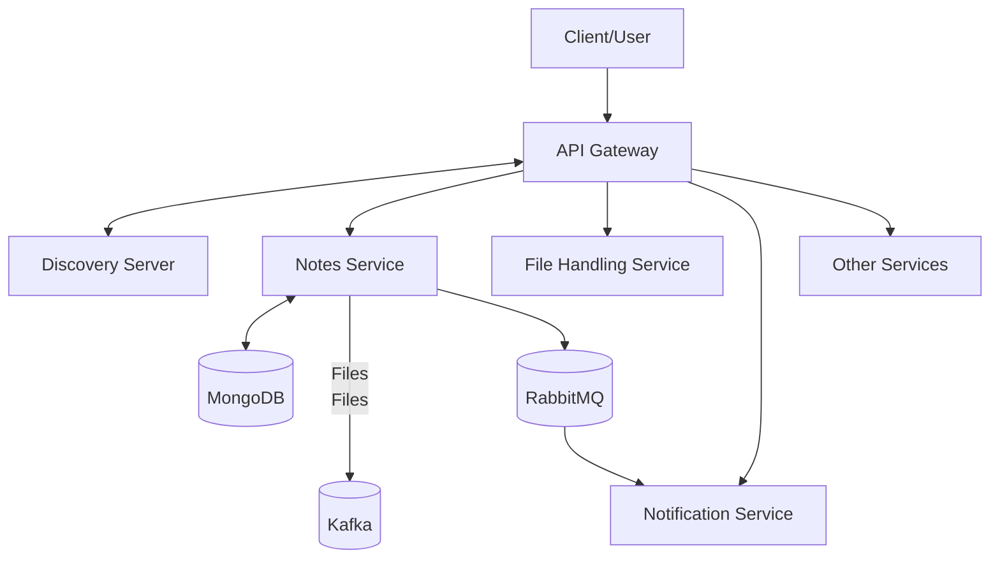
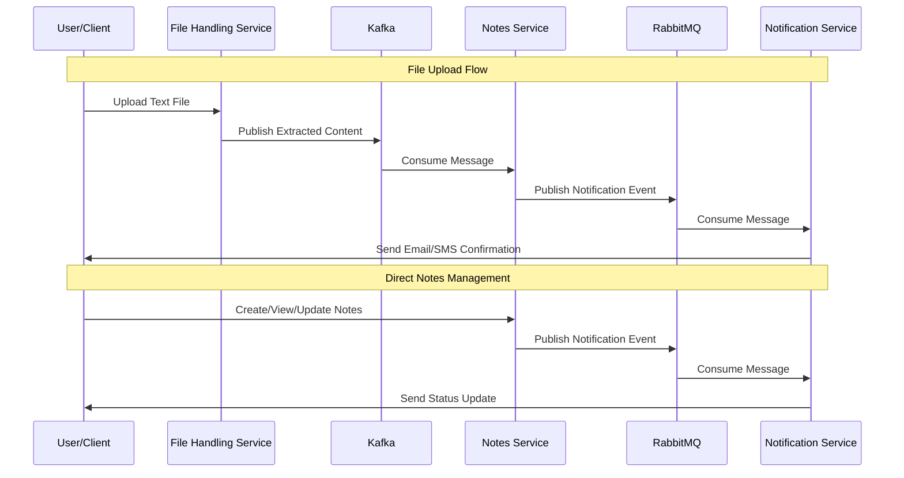

# Notes Application

A modern, microservices-based system for managing personal notes with advanced features including file processing, notifications, and API gateway integration. Built using Spring Boot and following cloud-native architecture patterns.

## 🏗️ Architecture

The application consists of the following microservices:

- **Main Service** (notes-application) - Core functionality for note management
- **Notification Service** - Handles email and SMS notifications
- **File Handling Service** - Processes uploaded text files
- **API Gateway** - Routes requests to appropriate services
- **Discovery Server** (Eureka) - Service discovery and registration

### Architecture Diagram



## 🔄 Data Flow



## 🧰 Technology Stack

- **Java**: JDK 21
- **Framework**: Spring Boot 3.4.x
- **Service Discovery**: Netflix Eureka
- **Database**: MongoDB
- **Message Brokers**:
  - RabbitMQ for notification queues
  - Kafka for file processing
- **Notification Providers**:
  - SendGrid for email notifications
  - Twilio for SMS notifications
- **Build Tool**: Maven
- **Containerization**: Docker
- **API Documentation**: SpringDoc/OpenAPI

## 🚀 Getting Started

### Prerequisites

- JDK 21
- Docker and Docker Compose
- Maven
- MongoDB
- RabbitMQ
- Kafka

### Setup and Installation

1. Clone the repository
   ```bash
   git clone [repository-url]
   cd notes-application
   ```

2. Build all services
   ```bash
   mvn clean package
   ```

3. Run using Docker
   ```bash
   docker build -t notes-application .
   docker run -p 8080:8080 notes-application
   ```

## ⚙️ Configuration

Each service has its own configuration in `application.properties` or `application.yml`:

- MongoDB Connection
- RabbitMQ Settings
- Kafka Topics
- SendGrid API Keys
- Twilio Account Information

## 🔌 API Endpoints

### Notes Service
- `GET /api/notes/{username}` - Get all notes for a user
- `POST /api/notes/{username}` - Create a new note
- `PUT /api/notes/{username}/{id}` - Update a note
- `DELETE /api/notes/{username}/{id}` - Delete a note

### File Handling Service
- `POST /users/{username}/files/upload` - Upload a text file for processing

## 🐳 Docker Setup

The application uses a multi-stage Docker build:
- Build stage with Maven and JDK 21
- Runtime stage with JDK 21
- Application JAR is copied from build to runtime stage

## 🔮 Future Enhancements

- **Authentication & Authorization**: Implement OAuth2/JWT
- **Metrics & Monitoring**: Add Prometheus/Grafina
- **CI/CD Pipeline**: Add automated testing and deployment
- **Kubernetes Deployment**: Create K8s configuration
